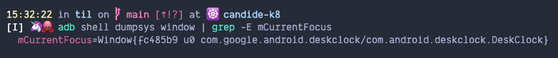

# Get package and activity name of currently focussed app

To get the app package and app activity for any android device,Open the terminal and write the below command:

`adb shell dumpsys window | grep -E mCurrentFocus`

This is useful if you are trying to automate the opening of an app with Appium